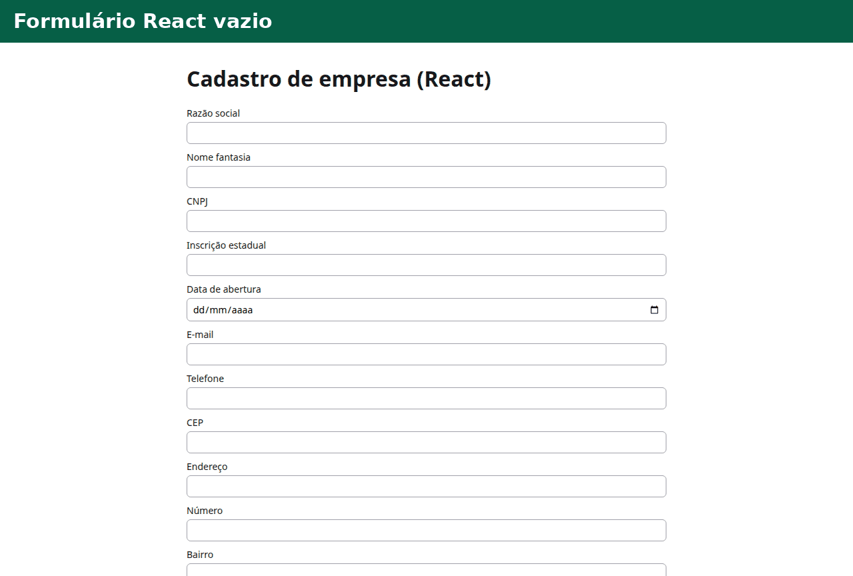

# Mocado

Extensão de navegador que gera dados de teste brasileiros válidos, preenche formulários com eles e guarda um histórico para você saber depois qual CPF foi usado em qual cadastro.

> ⚠️ **Dados fictícios, matematicamente válidos, apenas para testes de software.**



Funciona no Chrome, Edge, Brave, Opera e Firefox. Tudo roda no navegador: sem rede, sem telemetria, sem conta.

## Como usar

| Ação                              | Como                                                                                                                  |
| --------------------------------- | --------------------------------------------------------------------------------------------------------------------- |
| Preencher o formulário inteiro    | `Ctrl+Shift+F` (Mac: `Cmd+Shift+F`), botão **Preencher página** no popup ou menu de contexto **Preencher formulário** |
| Preencher só o campo focado       | `Alt+Shift+F`                                                                                                         |
| Gerar um tipo específico no campo | Botão direito → **Gerar aqui** → CPF, CNPJ…                                                                           |
| Corrigir um tipo detectado errado | Botão direito → **Marcar este campo como** → tipo (vale para o domínio inteiro)                                       |
| Gerar um valor solto e copiar     | Popup → escolha o gerador → **Copiar**                                                                                |
| Reusar um perfil                  | Popup → **Últimos perfis** → Reusar, ou Histórico → **Reusar este perfil** (vale para o próximo preenchimento)        |

Os atalhos podem ser trocados em `chrome://extensions/shortcuts` ou, no Firefox, em `about:addons` → engrenagem → _Gerenciar atalhos_.

A interface segue o idioma do navegador. Para fixar português ou inglês, use o botão **PT/EN** no topo do popup ou **Opções → Idioma**.

No histórico dá para colar um CPF (com ou sem pontuação) e ver em que site e quando ele foi usado, dar um rótulo ao perfil ("admin teste", "cliente PJ"), favoritar, reusar, excluir e exportar/importar tudo em JSON.

## O que ele gera

- **Documentos:** CPF (com UF de emissão), CNPJ numérico e alfanumérico (IN RFB 2.229/2024), RG (SSP-SP), CNH, PIS/PASEP, título de eleitor (com UF), inscrição estadual das 27 UFs, RENAVAM e certidões de nascimento, casamento e óbito.
- **Pessoa:** nome por sexo, mãe e pai, nascimento dentro de uma faixa de idade, e-mail derivado do nome, telefone fixo e celular com DDD da UF, senha configurável.
- **Endereço:** CEP, logradouro, bairro, cidade e UF reais e coerentes, de um dataset embutido.
- **Empresa:** razão social, nome fantasia, CNPJ, IE da UF do endereço e data de abertura.
- **Financeiro:** cartão de crédito (Visa, Mastercard, Amex, Elo, Hipercard, Diners) com Luhn, validade futura e CVV; conta bancária do BB, Bradesco, Itaú, Caixa e Santander com o dígito de cada banco.
- **Veículo:** placa antiga e Mercosul, RENAVAM, marca e modelo.
- **Outros:** lorem ipsum, número aleatório, UUID.

Uma _pessoa_ gerada é coerente: a mesma UF aparece no CPF, no título, no DDD e no endereço. Os e-mails usam domínios reservados (`example.com/net/org`, RFC 2606) para nunca cair na caixa de alguém de verdade.

## Privacidade

- O Mocado **não faz nenhuma requisição de rede**. Os dados são gerados por algoritmos dentro da extensão, e o dataset de endereços já vem no pacote.
- Não há telemetria, analytics, contas nem servidores.
- Histórico, opções e correções de campos ficam só em `browser.storage.local`, no seu computador. Desinstalar a extensão apaga tudo. O JSON exportado fica com você.
- A extensão **só lê uma página quando você pede** (atalho, menu ou popup). Nesse momento ela lê a estrutura dos campos (atributos e rótulos) e registra no histórico o domínio e a URL do preenchimento. Ela não lê nem guarda o que você digitou.

Permissões pedidas, e só estas:

| Permissão      | Por quê                                                                |
| -------------- | ---------------------------------------------------------------------- |
| `activeTab`    | Acessar a aba atual só depois de um gesto seu (atalho, menu, popup).   |
| `scripting`    | Injetar nessa aba o script que detecta e preenche os campos.           |
| `storage`      | Guardar histórico, opções e correções localmente.                      |
| `contextMenus` | Itens "Preencher formulário", "Gerar aqui" e "Marcar este campo como". |

Não há host permissions nem `<all_urls>`.

## Como funciona

### Fluxo de um preenchimento

1. Um gesto do usuário (atalho, menu de contexto ou popup) chega ao **background**, o que concede `activeTab` para a aba.
2. O background injeta `injected.js` na aba com `scripting.executeScript` (uma vez por aba) e chama `__mocado.scan()`. O script devolve os tipos de campo encontrados.
3. O background escolhe o perfil: se a página tem CNPJ, razão social ou outro campo de empresa, gera uma _empresa_; senão, uma _pessoa_. Um perfil fixado pelo histórico tem prioridade.
4. O background chama `__mocado.fill(perfil)`, o script preenche, e o uso é gravado no histórico.

A geração fica no background porque o script injetado não importa o `@mocado/core` nem os datasets: ele tem ~15 kB e o build falha se passar de 25 kB.

### Detecção dos campos

Cada campo recebe pontos por fonte: `autocomplete` 100, `<label>`/`aria-label` 45, `name`/`id` 40, `placeholder` 30, `title` 20 e texto próximo 15. Os pontos são multiplicados pela força da frase encontrada (frases longas valem mais; palavras genéricas como "nome", "doc" e "numero" valem metade), mais dicas de `type`. Abaixo de 12 pontos o campo é ignorado, assim como busca, captcha, token e OTP. Os sinônimos em português e inglês ficam em `apps/extension/src/content/detect/synonyms.ts`.

O texto próximo só conta quando não há `<label>` e nunca atravessa outro campo. A busca entra em shadow DOM aberto e em iframes same-origin; iframes de outra origem ficam de fora por design.

Se um campo é detectado errado, "Marcar este campo como" grava `{domínio → seletor estável → tipo}`. O seletor é `#id` (se o id não parece gerado), senão `[name]`, senão um caminho `tag:nth-of-type` a partir do `<form>`.

### Formato e preenchimento

O formato esperado (com ou sem máscara) vem de `pattern` (testado contra exemplos com e sem máscara), depois `maxlength`, depois um `placeholder` com cara de máscara e, por último, a máscara padrão das Opções. `type=number` sempre recebe só dígitos.

O valor é escrito pelo setter nativo do protótipo do próprio elemento (iframes têm protótipos próprios), seguido de `input`, `change` e `blur`, o que funciona com React, Vue e Angular. Se o valor final não bate (bibliotecas de máscara que só aceitam teclado), o campo é redigitado caractere a caractere. Radios de sexo casam pelo rótulo; outros grupos recebem a primeira opção; checkboxes só são marcados se `required`; selects sem tipo recebem uma opção não vazia.

Depois do primeiro preenchimento, um `MutationObserver` (debounce de 250 ms) preenche com o mesmo perfil os campos que surgirem depois, como wizards e modais. Ele não vê mutações dentro de shadow roots nem de iframes; esses campos entram no próximo gatilho. Dá para desligar nas Opções.

### Histórico

Cada registro tem os valores gerados e uma lista de usos (domínio, URL, data). Reusar um perfil acrescenta um uso ao mesmo registro em vez de duplicá-lo, então "qual CPF foi usado em qual cadastro" fica num lugar só.

A busca ignora acentos e caixa e, a partir de 3 caracteres, compara só letras e dígitos: colar um CPF sem máscara acha o CPF mascarado.

"Reusar" na página de histórico **fixa** o perfil para o próximo preenchimento (ela está em outra aba e não tem `activeTab` na aba de destino). No popup, "Reusar" preenche direto.

A importação valida cada registro: chaves desconhecidas são descartadas e o modo padrão é mesclar por id.

### Organização do código

```
packages/core       geradores, validadores e máscaras em TypeScript puro, sem nenhuma API de navegador
apps/extension      a extensão (WXT, Manifest V3)
  entrypoints/      background, script injetado, popup, páginas de histórico e opções
  src/domain        regras puras: perfis, histórico, busca, configurações
  src/application   casos de uso (preencher formulário, preencher campo, histórico, preferências) e as portas que eles usam
  src/infra         implementações reais das portas: browser.storage, scripting, menus, i18n
  src/content       código que roda na página: detecção e preenchimento
  src/ui            React + Tailwind, só no popup e nas páginas de histórico/opções
  e2e/, test/       testes Playwright e helpers dos testes unitários
apps/playground     formulários de teste (HTML puro, React controlado, máscaras, SPA/modal, nomes ruins)
```

O `eslint.config.js` impede que `domain` e `application` usem `browser.*`, React ou camadas externas, e que `content` importe valores do core. Os casos de uso são funções criadas com as dependências (`makeFillForm(deps)`), e o único lugar que liga as implementações reais é `src/infra/container.ts`. Nos testes, as mesmas portas têm versões em memória (`test/fakes.ts`).

Os identificadores do código estão em inglês. Ficam em português os ids de campo (`nome`, `razaoSocial`…), as chaves de i18n e tudo que é gravado em `storage.local` ou no JSON exportado, para não quebrar históricos existentes.

### Notas sobre os algoritmos do core

- Todo gerador aceita um `rng`; com `mulberry32(seed)` o resultado é determinístico. O UUID também sai do RNG, então o core não depende de nenhuma API de plataforma.
- `Generator` (`generate`, `validate`, `format`) só existe para tipos com estrutura verificável (documentos, placa, cartão, CEP, telefone). Nome, lorem e senha são funções simples.
- **CPF:** o 9º dígito é a região fiscal da UF escolhida.
- **CNPJ alfanumérico:** raiz de 8 caracteres `[0-9A-Z]` com pelo menos uma letra, filial `0001`, DV módulo 11 sobre `código ASCII − 48`, conferido com o exemplo oficial `12.ABC.345/01DE-35`. O padrão é numérico.
- **Inscrição estadual:** cada UF tem gerador e validador próprios. Valem os formatos atuais e alguns legados (BA 8 dígitos, RN 10, MT 9, TO 11, SP produtor rural `P…`). O prefixo só é exigido onde o SINTEGRA exige (AC, AL, AP, CE, GO, MA, MS, PA, RN, RR, DF).
- **Contas bancárias:** BB usa "X" para resto 10; Bradesco usa "0" na agência e "P" na conta.
- **RG:** algoritmo SSP-SP para qualquer UF, o único com DV padronizado.
- **Endereços:** 253 endereços reais, de 2 a 4 cidades por UF, consultados no ViaCEP uma única vez por `packages/core/scripts/build-ceps.ts` e versionados como JSON.

Os algoritmos são implementação própria, conferidos com exemplos de [gammasoft/ie](https://github.com/gammasoft/ie) (IE, em `test/ie-fixtures.json`), [darkroomdevs/CheckDigitValidator](https://github.com/darkroomdevs/CheckDigitValidator) (bancos) e [js-brasil](https://github.com/mariohmol/js-brasil) (certidão, título, PIS, RENAVAM e RG).

## Desenvolvimento

Requisitos: Node 22+ e pnpm 12 (`corepack enable pnpm`).

```sh
pnpm install
pnpm --filter extension dev          # Chrome com hot reload
pnpm --filter extension dev:firefox  # Firefox
pnpm --filter playground dev         # formulários de teste em http://localhost:5174
pnpm check                           # lint + typecheck + testes + build (o mesmo que o CI)
pnpm e2e                             # Playwright carregando a extensão no Chromium
pnpm zip                             # ZIPs para Chrome, Firefox e código-fonte
```

Para o e2e, instale o Chromium do Playwright uma vez: `pnpm --filter extension exec playwright install chromium`. O Playwright não consegue apertar atalhos de extensão, então `pnpm e2e` usa um build separado (`MOCADO_E2E=1`, saída em `.output/e2e`) que adiciona `http://localhost/*` às permissões; os testes chamam os mesmos handlers de atalho e menu pelo `globalThis.mocado` do background.

Regras do projeto:

- **Commits** em [Conventional Commits](https://www.conventionalcommits.org/pt-br/) (`feat(core): …`, `fix(extension): …`).
- **Core:** nada de APIs de navegador (o tsconfig nem inclui a lib DOM). Gerador com dígito verificador precisa de teste gera→valida com milhares de iterações e de pelo menos um exemplo real conhecido. A cobertura mínima é 90% de linhas.
- **Script injetado:** TypeScript puro, sem React e sem valores do core (só tipos).
- **Textos de interface:** sempre via `t(...)` de `src/infra/browser/i18n.ts`, com a chave em `locales/pt_BR.yml` e `locales/en.yml`. Um teste confere que os dois têm as mesmas chaves. Com um idioma escolhido nas opções, `t` lê `/_locales/<idioma>/messages.json` do próprio pacote em vez de `chrome.i18n`; nome, descrição e atalhos do manifesto continuam no idioma do navegador.
- **Permissões:** só as quatro da tabela acima. Nada de host permissions fixas, rede ou telemetria.
- **Novo tipo de campo:** adicione em `FIELD_TYPES` (`packages/core/src/profiles.ts`), os sinônimos em `synonyms.ts`, casos em `classify.test.ts` e o rótulo `field.<tipo>` nos dois locales.
- **Formulário que o Mocado preenche mal:** crie uma página em `apps/playground` e um caso no e2e.
- Ícones: `pnpm --filter extension icons` gera os PNGs a partir de `assets/icon.svg`. GIF e screenshots: `pnpm --filter extension demo`.

## Publicação

```sh
pnpm install --frozen-lockfile
pnpm check && pnpm e2e
pnpm --filter extension lint:firefox   # web-ext lint: 0 erros
pnpm zip
```

Em `apps/extension/.output/` saem `mocado-chrome.zip` (Chrome Web Store, Edge e Opera), `mocado-firefox.zip` (AMO) e `mocado-sources.zip` (código-fonte para a revisão da AMO). O CI gera os mesmos ZIPs como artifact `mocado-zips` a cada push.

Antes de enviar: atualizar a versão em `apps/extension/package.json` (é ela que vai para o manifest) e testar à mão no Firefox (`about:debugging` → _Carregar extensão temporária_) e no Chrome (`chrome://extensions` → _Carregar sem compactação_) com as páginas do playground.

Na Chrome Web Store, o propósito único é "gerar dados de teste brasileiros e preenchê-los em formulários web, mantendo um histórico local dos dados usados"; não há coleta de dados nem código remoto. No Firefox, o manifest já declara `data_collection_permissions.required = ["none"]`.

Instruções de build para os revisores da AMO:

```sh
# Node.js 22+, pnpm 12 via corepack
corepack enable pnpm
pnpm install --frozen-lockfile
pnpm --filter extension exec wxt build -b firefox --mv3
# saída: apps/extension/.output/firefox-mv3 (igual ao mocado-firefox.zip; minificado, não ofuscado)
```

## Licença

[MIT](LICENSE)

---

## English

**Mocado** is a browser extension (Chrome, Edge, Brave, Opera, Firefox) that detects form fields, generates **valid Brazilian test data** (CPF, CNPJ including the new alphanumeric format, state registration for all 27 states, CNH, RENAVAM, credit cards, bank accounts, coherent people and companies with real addresses) and fills them with one click or `Ctrl+Shift+F`. It works with React, Vue, Angular and input-mask libraries. Every fill is saved to a searchable history, so you can paste a CPF and find where it was used, label profiles, reuse them and export/import JSON.

Everything runs locally: no network requests, no telemetry, data stays in `storage.local`. Pages are only accessed after an explicit user action (`activeTab`). _Fictitious, mathematically valid data, for software testing only._ The UI is in Portuguese, and in English when your browser runs in English.
